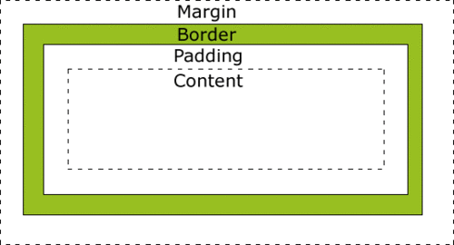

# html+css（主要是css盒模型）

## HTML标签

\<ul> 无序列表\
\<ol> 有序列表\
\<li> 列表项\
\
 段落

## CSS盒模型

所有HTML元素可以看作盒子，在CSS中，"box model"这一术语是用来设计和布局时使用。

CSS盒模型本质上是一个盒子，封装周围的HTML元素，它包括：外边距（margin）、边框（border）、内边距（padding）、实际内容（content）四个属性。

盒模型允许我们在其它元素和周围元素边框之间的空间放置元素。\

