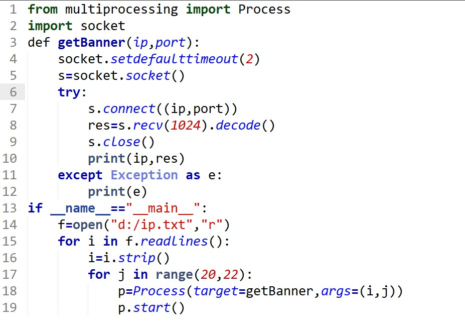

# 一些好幽默的判断/填空题

<mark style="color:blue;">**最小权限原则（Polp）**</mark>要求仅授予用户完成其任务所需的最小权限\
\
web浏览器通过 <mark style="color:blue;">**TCP/IP**</mark> 协议与web服务器进行通信\
\
preg\_match()函数用于<mark style="color:blue;">**执行正则表达式匹配**</mark>\
\
常见的web服务器软件包括Apache、Nginx和<mark style="color:blue;">**Tomcat Node.js**</mark>\
\
Metasploit 框架中的 Meterpreter 后渗透功能经常使用哪个函数来进行进程迁移?\
[<mark style="color:blue;">**migrate函数**</mark>](#user-content-fn-1)[^1]

<figure><figcaption><p>banner信息就是指服务器返回给你的响应头的相关信息，例如：返回过来的状态码，服务版本号......等等。通过这些banner信息可以得到一个服务器的端口号、上面安装了哪些服务？以及服务相应的版本......等等，从而可以找到相应的漏洞。</p></figcaption></figure>

php中检查一个变量是否已设置并且不为null使用<mark style="color:blue;">**isset()**</mark>

在 PHP 中，有两种类型的数组： <mark style="color:blue;">**索引数组 关联数组**</mark>

```
4.简述在Centos Linux7下配置本地YUM源的过程。
参考答案：
1)将系统镜像ISO文件挂载到/mnt
2)编辑YUM配置文件/etc/yum.repos.d/mydvd.repo
[mydvd]
name=centos7-local
baseurl=file:///mnt/
enabled=1
gpgchecked=0
3)清除yum缓存yum clean all
4)yum源测试 yum list all
```

wireshark程序页面可分为三个部分，分别是<mark style="color:blue;">包分组列表，包分组详情，包分组字节流</mark>

Linux文件系统类型分为<mark style="color:blue;">**ext3 ext4 XFS ZFS**</mark>

Linux文件类型为<mark style="color:blue;">**文件，目录，链接**</mark>等

为了防止XSS漏洞，PHP开发者应该对用户输入进行<mark style="color:blue;">html实体编码，输入过滤</mark>处理

是的php也是可以定义<mark style="color:blue;">**function**</mark>函数变量的

[^1]: 
