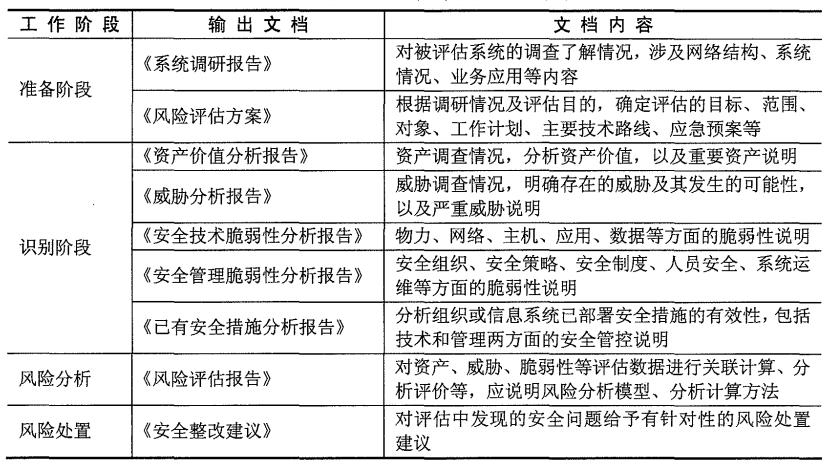

# PDCA循环

PDCA（plan-do-check-act 或者 plan-do-check-adjust）循环的 4 个阶段，“策划- 实施-检查-改进”。

1、P（Plan）计划，包括方针和目标的确定，以及活动规划的制定。&#x20;

2、D（Do）执行，根据已知的信息，设计具体的方法、方案和计划布局；再根据设计和布局，进行具体运作，实现计划中的内容。&#x20;

3、C（Check）检查，总结执行计划的结果，分清哪些对了，哪些错了，明确效果，找出问题。&#x20;

4、A（Act）处理，对总结检查的结果进行处理，对成功的经验加以肯定，并予以标准化；对于失败的教训也要总结，引起重视。对于没有解决的问题，应提交给下一个PDCA循环中去解决。

<figure><figcaption></figcaption></figure>
