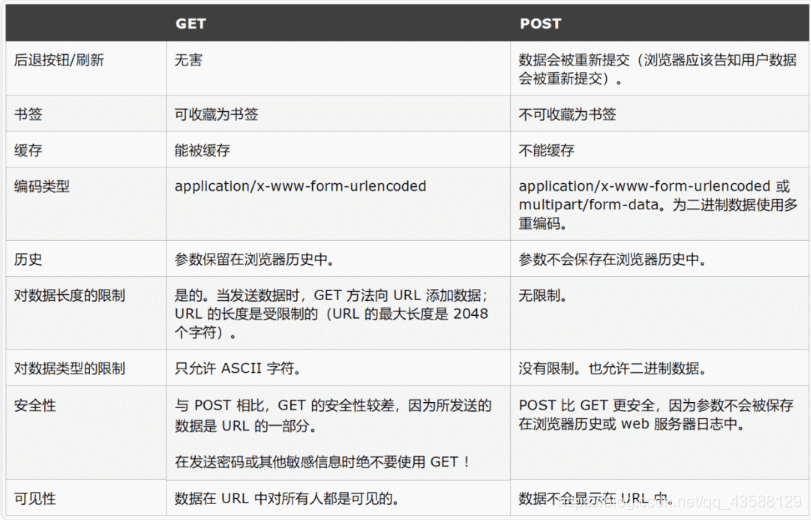

# GET\&POST传参的区别

GET和POST是HTTP协议中两种主要的请求方法\
GET用于请求数据，通常用于查询操作，请求数据会附加在URL中，长度有限制，且不适合传输敏感数据。\
POST用于提交数据，常用于表单提交，请求数据放在请求体中，长度无限制，适合传输大量或者敏感的数据。\
GET的请求可以被缓存或书签保存，而POST不行。\
因此，选择使用GET还是POST需要根据具体需求和数据特点来决定

<figure><figcaption></figcaption></figure>
